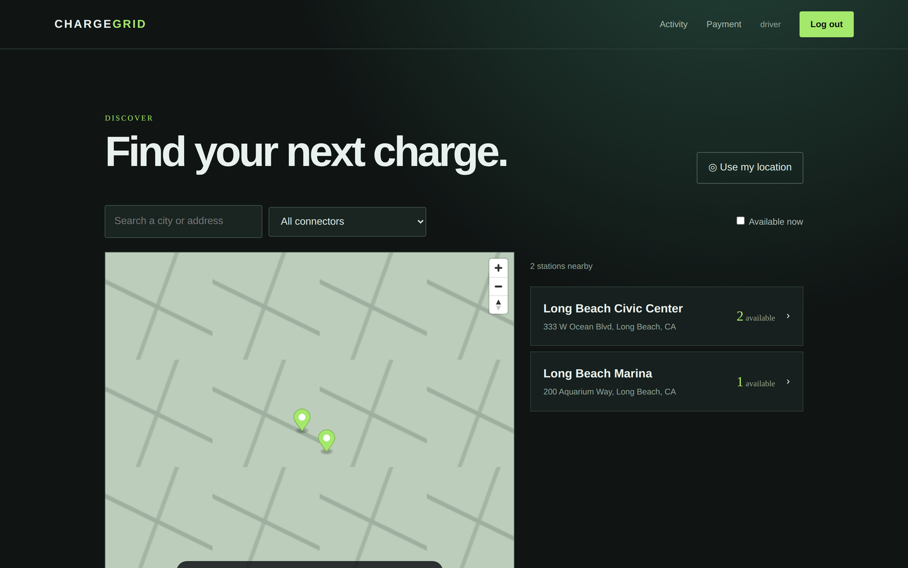
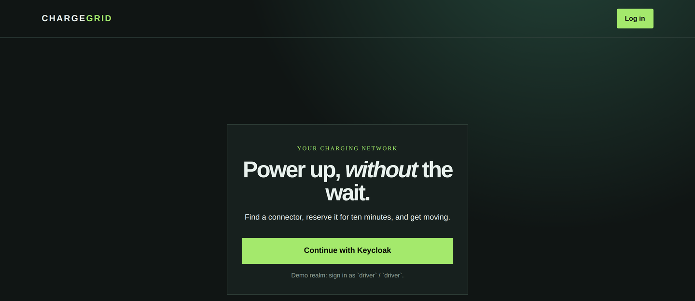
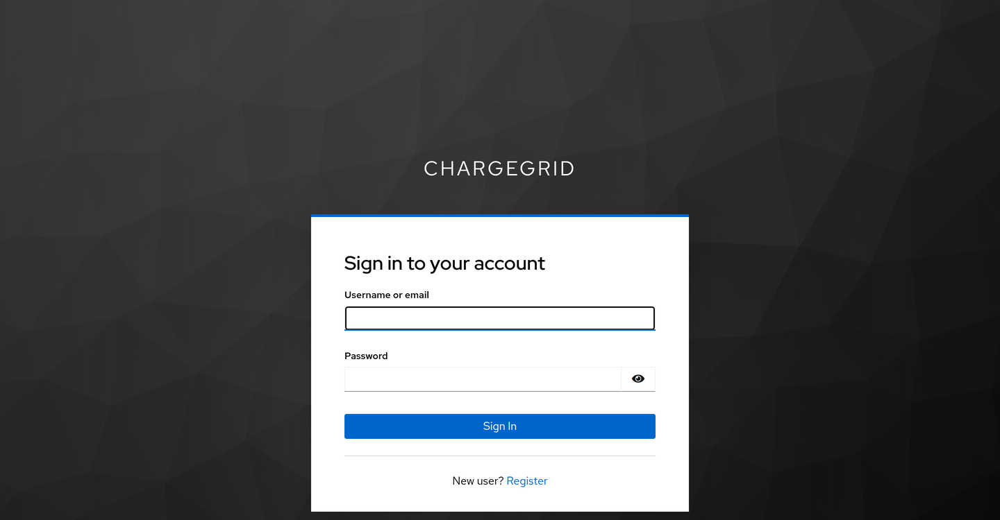
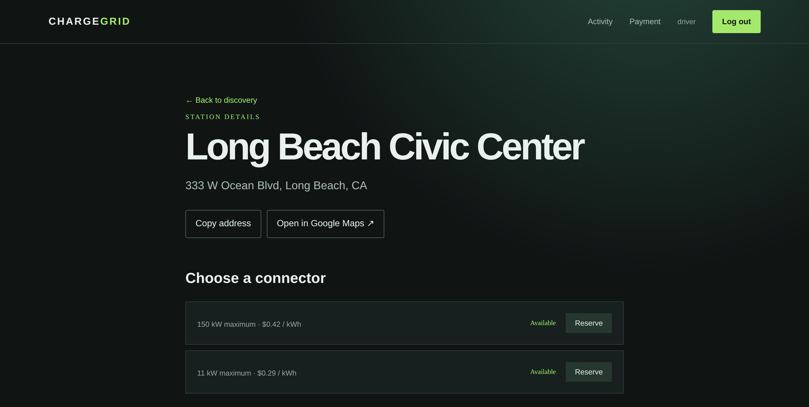
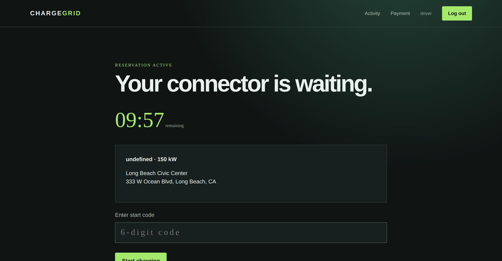
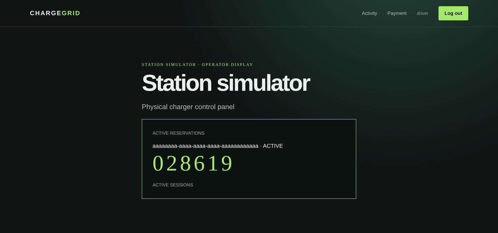
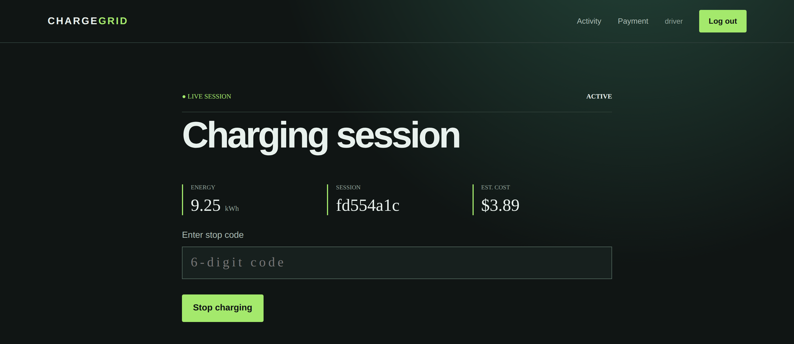
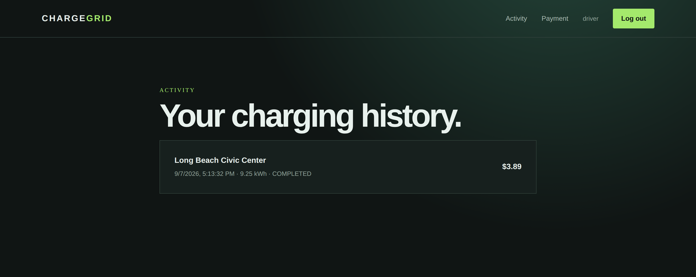

# ChargeGrid

An EV charging platform: find a station, reserve a connector, prove you are
standing at it, draw energy, and settle the bill. Six Spring Boot services
behind an API gateway, a React front end, Keycloak for identity, PostGIS for
spatial search, Redis and RabbitMQ for coordination.



## The journey

<table>
<tr>
<td width="50%"></td>
<td width="50%"></td>
</tr>
<tr>
<td>Sign-in, which redirects to Keycloak…</td>
<td>…using Authorization Code flow with PKCE.</td>
</tr>
<tr>
<td></td>
<td></td>
</tr>
<tr>
<td>Connectors with live availability and per-kWh price.</td>
<td>A ten-minute hold, counting down.</td>
</tr>
<tr>
<td></td>
<td></td>
</tr>
<tr>
<td>The operator display stands in for the charger, showing the start code.</td>
<td>Energy metered by the charger, priced at the reserved rate.</td>
</tr>
</table>



## Run it

```bash
cp .env.example .env
cp frontend/.env.example frontend/.env

docker compose up -d                          # Postgres/PostGIS, Redis, RabbitMQ, Keycloak
docker compose --profile apps up -d --build   # the six services

cd frontend && npm install && npm run dev
```

Open <http://localhost:5173> and sign in as **`driver` / `driver`** (seeded by
the realm import).

Card capture needs Stripe test keys: put `STRIPE_SECRET_KEY` in the root `.env`
and `VITE_STRIPE_PUBLISHABLE_KEY` in `frontend/.env`. Save `4242 4242 4242 4242`
with any future expiry, and the card is charged automatically when a session
ends.

To walk the whole flow, open the operator display for a station in a second tab:

```
http://localhost:5173/admin/stations/<stationId>/simulator
```

It shows the codes the charger would display and lets you push meter readings.

Keycloak is at <http://localhost:8080>, RabbitMQ management at
<http://localhost:15672>.

## How it fits together

| Service | Port | Owns |
| --- | --- | --- |
| `api-gateway` | 8088 | Routing, CORS, token validation, caller identity |
| `user-service` | 8081 | Driver profiles keyed by Keycloak subject |
| `discovery-service` | 8082 | Station catalogue, spatial search, connector tariffs |
| `session-service` | 8083 | Reservations, charger codes, metering, session events |
| `billing-service` | 8085 | Stripe invoices, idempotent settlement |
| `notification-service` | 8086 | Email delivery driven off events |

Full detail, including sequence diagrams and the trust boundary, is in
[docs/ARCHITECTURE.md](docs/ARCHITECTURE.md). The reasoning behind the
non-obvious choices, and what each one costs, is in
[docs/DECISIONS.md](docs/DECISIONS.md).

Three things worth calling out:

**One live reservation per connector is enforced twice.** A distributed lock
serialises attempts, and a partial unique index —
`UNIQUE (connector_id) WHERE active = true` — is the backstop that holds even
if Redis is down or two instances race.

**Identity is set at the gateway, never by the client.** The gateway strips any
inbound `X-User-Id` and writes the validated token's subject in its place.
Without the strip, a driver with a valid token could read another driver's
reservations by sending a different id.

**Tariffs are snapshotted when a driver reserves.** Cost is energy times the
rate stored on the reservation, so a later price change cannot retroactively
rewrite a finished session.

**Events go through a transactional outbox.** A completed session and the event
announcing it commit together, and a relay drains the outbox to a topic
exchange, so a crash cannot lose the receipt or the charge.

## Development

Each service owns its own database and its own Flyway history. They must not
share one: two services migrating into the same database collide on schema
history version 1, and the second to start fails validation and exits.

```bash
mvn test              # per service; spotless:check runs at validate
mvn spotless:apply    # fix formatting

cd frontend
npm run format:check
npm run build
```

Integration tests run against real PostGIS, Redis and RabbitMQ. They skip when
those are not running, so `mvn test` works on a clean checkout;
`CHARGEGRID_REQUIRE_INTEGRATION=true` turns the skip into a failure, which is
how CI guarantees they actually ran.

Formatting is enforced rather than maintained by hand — Spotless
(google-java-format, AOSP) for Java, Prettier for the front end. CI builds every
service, builds the front end, and validates the k8s manifests against
published Kubernetes schemas with kubeconform.

## Known gaps

- Webhook reconciliation is wired but unverified: it needs a publicly reachable
  URL and `STRIPE_WEBHOOK_SECRET`, so `stripe listen --forward-to` is the way to
  exercise it.
- A failed charge is recorded as a FAILED invoice and left there; there is no
  dunning or retry.
- The simulator's operator key is a shared secret shipped to the browser. Real
  hardware would use its own client-credentials token.
- No tax, refunds, or partial captures.

## Security

Real secrets belong only in local environment files or deployment secret stores.
Never commit Stripe, Resend, Keycloak, or database credentials.
