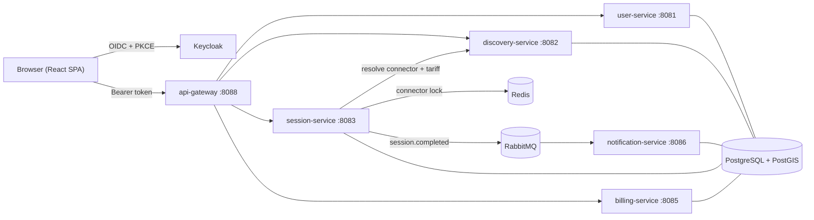
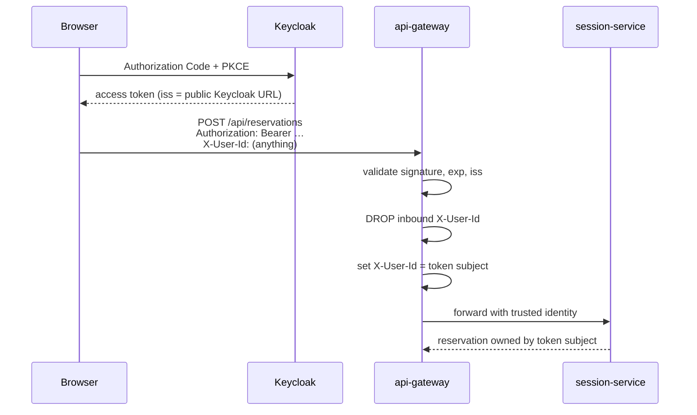
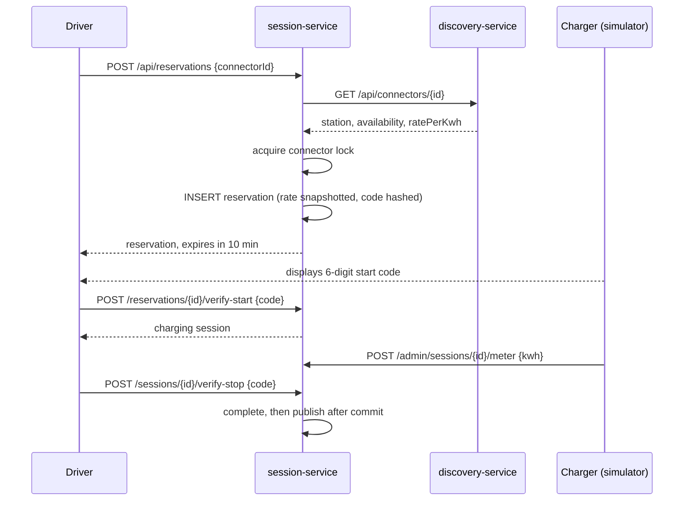

# Architecture

ChargeGrid models the journey a driver takes to charge an electric vehicle:
find a station, hold a connector, prove they are standing at it, draw energy,
and settle the bill.

## Service map



Each service owns its own database and its own Flyway history. They are not
interchangeable schemas in one database: two services migrating into the same
database collide on schema history version 1, and the second to start fails
validation and exits.

| Service | Owns |
| --- | --- |
| `api-gateway` | Routing, CORS, token validation, caller identity |
| `user-service` | Driver profiles keyed by Keycloak subject |
| `discovery-service` | Station catalogue, spatial search, connector tariffs |
| `session-service` | Reservations, charger codes, metering, session events |
| `billing-service` | Stripe invoices, idempotent settlement |
| `notification-service` | Email delivery driven off events |

## Identity and the trust boundary

Downstream services read the caller from an `X-User-Id` header. That is only
safe because of where the header is set.



`IdentityPropagationFilter` is the only thing permitted to set that header. It
strips whatever arrived before writing the token subject. Without the strip, a
driver holding a perfectly valid token for their own account could read another
driver's reservations just by sending a different id.

The services behind the gateway are ClusterIP-only, so the gateway is the sole
route in. That is what makes header-based identity acceptable; expose a service
directly and the assumption breaks.

### Issuer vs. key discovery

A token minted for the browser carries `iss = http://localhost:8080/realms/chargegrid`,
but a service inside compose reaches Keycloak at `http://keycloak:8080`. Letting
`issuer-uri` drive OIDC discovery ties both to one hostname and tokens get
rejected for a mismatched `iss`. The gateway and user-service therefore fetch
signing keys from `jwk-set-uri` (internal) while validating `iss` against
`issuer-uri` (public), and Keycloak runs with `KC_HOSTNAME` set to the public URL.

## The charging flow



### One live reservation per connector

Two drivers must never hold the same connector. This is enforced twice.

At the application layer, `ReservationLock` serialises attempts on a connector.
It has a Redis implementation for real deployments and an in-memory one for a
single node, chosen by `@ConditionalOnProperty`.

At the storage layer, a partial unique index is the backstop:

```sql
CREATE UNIQUE INDEX uk_active_connector
    ON reservations (connector_id) WHERE active = true;
```

The lock is an optimisation that keeps the common case from ever reaching a
constraint violation. The index is the guarantee: it holds even if Redis is
down, the lock is misconfigured, or a second instance races.

### Tariffs are snapshotted, not looked up

`discovery-service` owns what a connector costs. `session-service` reads that
rate once, when the driver reserves, and stores it on the reservation. Cost is
then energy times the stored rate.

Pricing a finished session by looking the tariff up again would let an operator
change a published price and retroactively rewrite what a driver already paid.

### Charger codes

Starting and stopping requires a six-digit code the charger displays, proving
the driver is physically present. Codes are bcrypt-hashed; a reservation carries
a failed-attempt budget, so the short code space is bounded by attempts rather
than by hashing alone.

The plaintext is also stored, in a column the simulator reads. In production
that value lives on the charger and never reaches this database — it is
persisted here only because the simulator stands in for that hardware.

### Events are published after commit

`session.completed` is raised as an in-process Spring event and relayed to
RabbitMQ by a listener bound to `AFTER_COMMIT`.

A broker outage must never roll back a charging session the driver has already
finished, so the publish happens after the database transaction commits, and a
publish failure is logged rather than rethrown.

The gap that remains is delivery: a crash between commit and publish loses the
event. Closing it properly means a transactional outbox — writing the event in
the same transaction and relaying it separately — which is the natural next step.

## Data ownership

| Database | Tables |
| --- | --- |
| `chargegrid_users` | `user_profiles` |
| `chargegrid_discovery` | `stations`, `connectors` (PostGIS `geography`, GIST index) |
| `chargegrid_sessions` | `reservations`, `charging_sessions`, `meter_readings` |
| `chargegrid_billing` | `invoices` (unique `idempotency_key`) |
| `chargegrid_notifications` | `email_deliveries` (unique `event_id`) |

Spatial search uses `ST_DWithin` against a GIST-indexed `geography` column so the
radius filter is index-assisted rather than a scan with distance computed per row.

## Known gaps

- No integration tests against real PostGIS or Redis; coverage is unit-level.
- The payment screen is a mock; card capture is not wired to Stripe Elements.
- `notification-service` consumes a fixed set of event types that does not yet
  include `ChargingSessionCompleted`, and session events carry no recipient
  address, so email is not actually sent end to end.
- Event delivery is at-most-once (see the outbox note above).
- The operator key is a shared secret shipped to the browser for the simulator.
  Real hardware would use its own client-credentials token.
